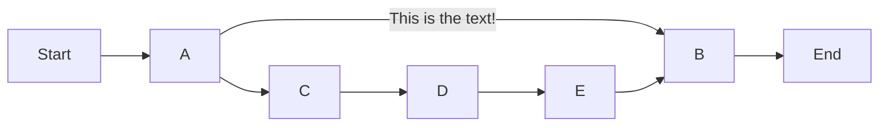
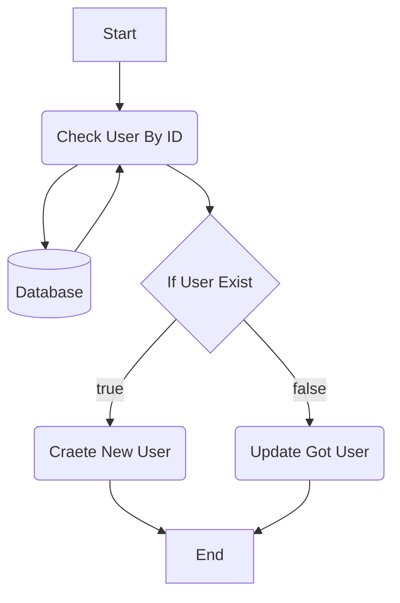
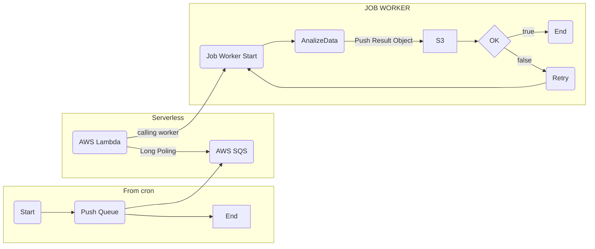
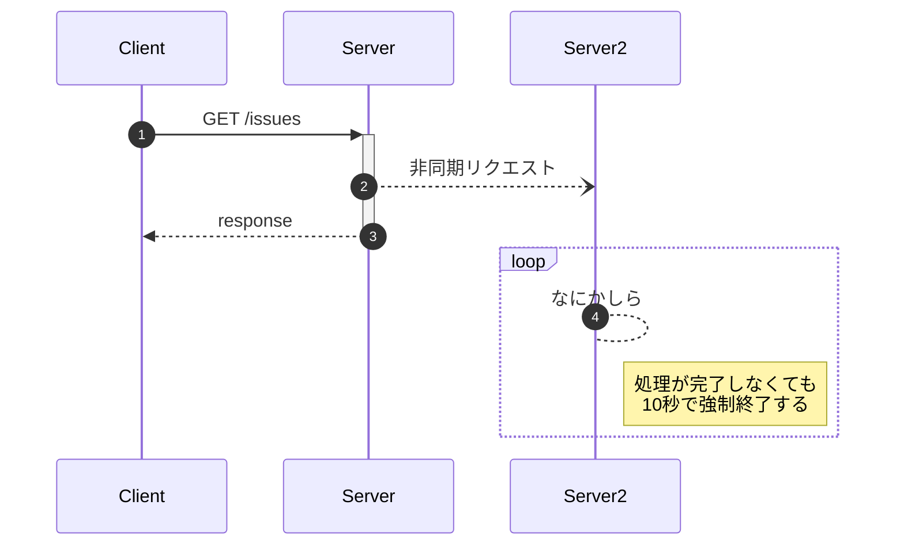
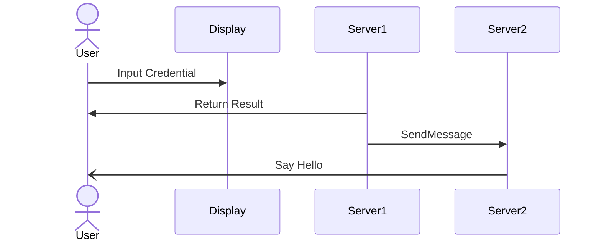
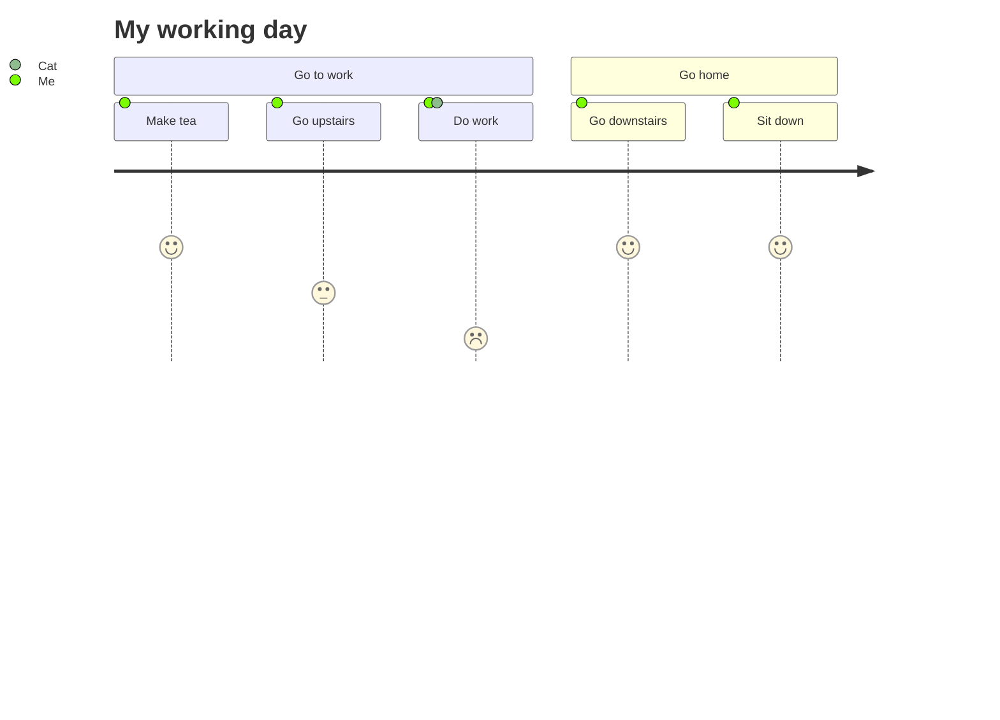

## フローチャート

```mermaid
flowchart LR
    Start-->A
    A-- This is the text! -->B
    A-->C
    C-->D
    D-->E
    E-->B
    B-->End
```

```mermaid
flowchart TD
    Start --> A(Check User By ID)
    A --> DB[(Database)]
    DB --> A
    A --> B{If User Exist}
    B -- true --> C(Craete New User)
    B -- false --> D(Update Got User)
    C --> End
    D --> End
```

```mermaid
flowchart LR

    subgraph From cron
    START(Start) --> B(Push Queue)
    B --> End
    end
    
    
    subgraph Serverless
    B --> SQS(AWS SQS)
    L(AWS Lambda) -- Long Poling --> SQS
    end
    
    
    subgraph JOB WORKER
    L -- calling worker --> J(Job Worker Start)
    
    J --> An(AnalizeData)
    
    S3 --> IF{OK} -- true --> BatchEnd(End)
    
    IF -- false --> Re(Retry) --> J
    
    An -- Push Result Object --> S3 
    end
```

## シーケンシャル図

```mermaid
sequenceDiagram
  autonumber
  Client->>+Server: GET /issues
  Server--)Server2: 非同期リクエスト
  Server-->>-Client: response
  loop
    Server2-->Server2: なにかしら
    Note right of Server2: 処理が完了しなくても<br/>10秒で強制終了する
  end
```

```mermaid
sequenceDiagram
  actor User
  User ->> Display: Input Credential
  Server1 ->> User: Return Result
  Server1 ->> Server2: SendMessage
  Server2 -) User: Say Hello
```

## ジャーニーマップ

```mermaid
journey
    title My working day
    section Go to work
      Make tea: 5: Me
      Go upstairs: 3: Me
      Do work: 1: Me, Cat
    section Go home
      Go downstairs: 5: Me
      Sit down: 5: Me
```
