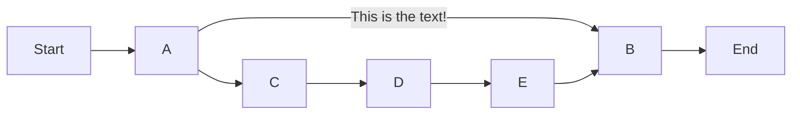
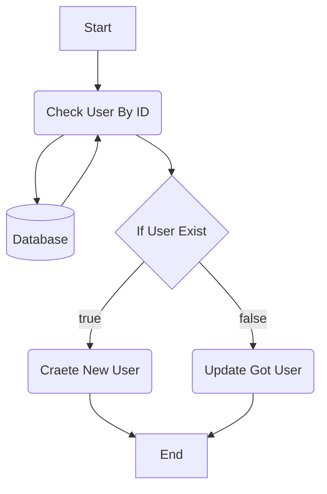
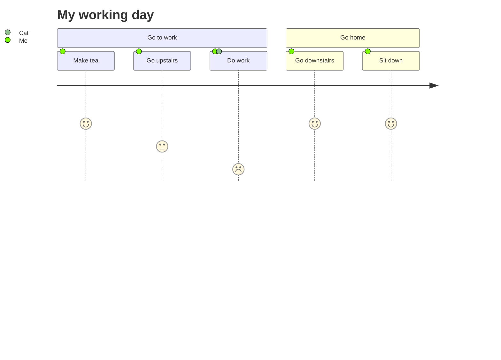

## フローチャート

```mermaid
flowchart LR
    Start-->A
    A-- This is the text! -->B
    A-->C
    C-->D
    D-->E
    E-->B
    B-->End
```

```mermaid
flowchart TD
    Start --> A(Check User By ID)
    A --> DB[(Database)]
    DB --> A
    A --> B{If User Exist}
    B -- true --> C(Craete New User)
    B -- false --> D(Update Got User)
    C --> End
    D --> End
```

## ジャーニーマップ

```mermaid
journey
    title My working day
    section Go to work
      Make tea: 5: Me
      Go upstairs: 3: Me
      Do work: 1: Me, Cat
    section Go home
      Go downstairs: 5: Me
      Sit down: 5: Me
```
